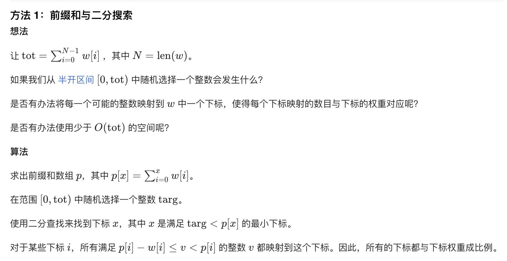

## 528. Random Pick with Weight

- [Link to LeetCode](https://leetcode.com/problems/random-pick-with-weight/)

**Description:**


You are given an array of positive integers `w` where `w[i]` describes the weight of `i``th` index (0-indexed).

We need to call the function `pickIndex()` which **randomly** returns an integer in the range `[0, w.length - 1]`. `pickIndex()` should return the integer proportional to its weight in the `w` array. For example, for `w = [1, 3]`, the probability of picking the index `0` is `1 / (1 + 3) = 0.25` (i.e 25%) while the probability of picking the index `1` is `3 / (1 + 3) = 0.75` (i.e 75%).

More formally, the probability of picking index `i` is `w[i] / sum(w)`.


<!-- tabs:start -->

### **Example 1:**

```
Input
["Solution","pickIndex"]
[[[1]],[]]
Output
[null,0]

Explanation
Solution solution = new Solution([1]);
solution.pickIndex(); // return 0. Since there is only one single element on the array the only option is to return the first element.
```

### **Example 2:**

```
Input
["Solution","pickIndex","pickIndex","pickIndex","pickIndex","pickIndex"]
[[[1,3]],[],[],[],[],[]]
Output
[null,1,1,1,1,0]

Explanation
Solution solution = new Solution([1, 3]);
solution.pickIndex(); // return 1. It's returning the second element (index = 1) that has probability of 3/4.
solution.pickIndex(); // return 1
solution.pickIndex(); // return 1
solution.pickIndex(); // return 1
solution.pickIndex(); // return 0. It's returning the first element (index = 0) that has probability of 1/4.

Since this is a randomization problem, multiple answers are allowed so the following outputs can be considered correct :
[null,1,1,1,1,0]
[null,1,1,1,1,1]
[null,1,1,1,0,0]
[null,1,1,1,0,1]
[null,1,0,1,0,0]
......
and so on.
```

<!-- tabs:end -->


**Constraints:**

- `1 <= w.length <= 10000`
- `1 <= w[i] <= 10^5`
- `pickIndex` will be called at most `10000` times.


<!-- tabs:start -->

#### **Solution 1**




```java
// Binary Search
// Time Complexity: O(n) preprocess, O(lgn) pick
// Space Complexity: O(n)
class Solution {
   private int[] prefixSum;
   private int sum;
  
   public Solution(int[] w) {
       prefixSum = new int[w.length];
       sum = 0;
       for (int i = 0; i < w.length; ++i) {
           sum += w[i];
           prefixSum[i] = sum;
       }
   }
  
   public int pickIndex() {
       Random rand = new Random();
       int target = rand.nextInt(sum);
       int l = 0;
       int r = prefixSum.length;
       while (l < r) {
           int m = l + (r - l) / 2;
           if (target < prefixSum[m])
               r = m;
           else
               l = m + 1;
       }
       return l;
   }
}
```


<!-- tabs:end -->


